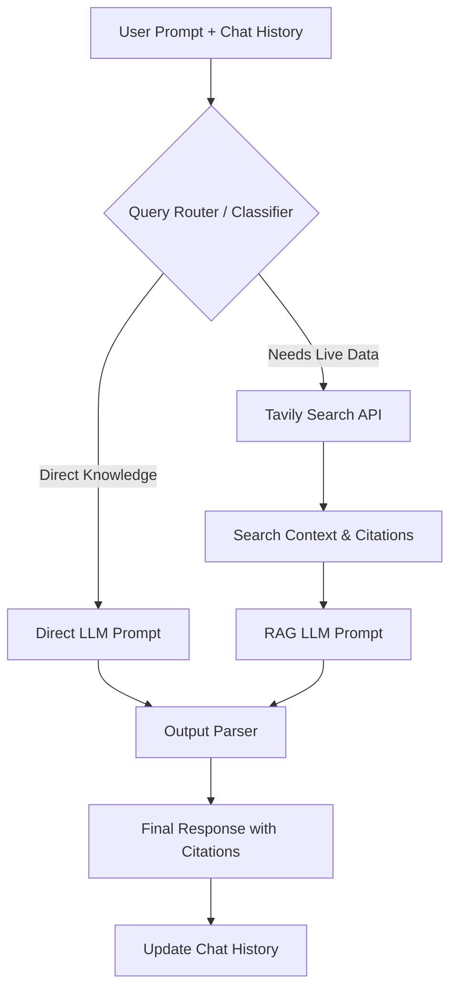

# Real-Time RAG Pipeline with Live Web Search & Memory


An intelligent, low-latency **Retrieval-Augmented Generation (RAG)** pipeline built using Python, LangChain, Tavily Search API, and the Cerebras Inference Engine. 

This project features **dynamic query routing** to decide whether a user's prompt can be answered using general knowledge or requires real-time web search for fresh, time-sensitive data, enhanced with **Conversational Memory** for seamless multi-turn interactions.

---

## Key Features

- **Fast Inference**: Powered by the Cerebras LLM engine (`gpt-oss-120b`) for rapid responses.
- **Conversational Memory**: Maintains context of recent conversation turns, allowing for natural follow-up questions.
- **Intelligent Query Routing**: Classifies queries automatically to avoid redundant search API calls.
  - **Direct Path**: For general concepts, definitions, and static knowledge.
  - **RAG Path**: For breaking news, recent events, stock/crypto prices, or time-sensitive topics.
- **Live Web Search Integration**: Searches and compiles web context via Tavily Search API.
- **Smart Citations**: Output automatically includes citation markers (e.g., `[Source 1]`) pointing to relevant URL references.
- **Robust Error Handling**: Handles API and network exceptions gracefully without interrupting the CLI session.
- **Environment Isolation**: Uses `python-dotenv` to keep API credentials secure and separated from the codebase.

---

## Architecture Flow



---

## Setup Instructions

### 1. Prerequisites
- **Python 3.9+**
- API keys for:
  - **[Cerebras Cloud](https://cloud.cerebras.ai/)** (Available via the Cerebras Console)
  - **[Tavily Search](https://tavily.com/)** (Available via the Tavily Dashboard)

### 2. Installation
Clone or download the project files, navigate to the directory, and install the dependencies:
```bash
git clone <your-repo-url>
cd rag-pipeline
pip install -r requirements.txt
```

### 3. Configuration
This project uses environment variables to manage credentials safely. 

1. Create a local `.env` file (you can copy `.env.example` if available):
   ```bash
   cp .env.example .env
   ```
2. Open `.env` and configure your API credentials:
   ```env
   CEREBRAS_API_KEY=your_actual_cerebras_key_here
   TAVILY_API_KEY=your_actual_tavily_key_here
   ```

---

## Running the Pipeline

Start the interactive session directly from your terminal:

```bash
python rag_pipeline.py
```

### Example Usage

```text
============================================================
Real-Time RAG Pipeline with Query Routing (with Conversational Memory)
Ask any question and get a cited answer from the live web!
Type 'quit' to exit.
============================================================

Your question: What is machine learning?
Route: direct_answer
Answering from general knowledge...

Answer:
Machine learning is a subset of artificial intelligence (AI) focused on building systems that learn from data...

Your question: And who won the latest Formula 1 race?
Route: web_search
Searching the web for: And who won the latest Formula 1 race?
Generating answer...

Answer:
Max Verstappen won the latest Formula 1 race [Source 1] ahead of Lando Norris [Source 2]...
```

### Testing Modules Interactively

To import and test components (such as the web search module) individually, run Python in interactive mode:

```bash
python -i rag_pipeline.py
```

Then invoke functions directly inside the interactive session:
```python
>>> print(search_web("What is retrieval augmented generation"))
```

---

## System Details

This project implements a low-latency, context-rich RAG pipeline. Below is a step-by-step breakdown:

1. **Initialization**: Connects to the **Cerebras LLM Engine** (using `gpt-oss-120b`) and **Tavily Search Client**.
2. **Context Management**: Gathers recent turns of `chat_history` to understand contextual or follow-up questions.
3. **Query Classification**: The agent sends the question and history to a classifier prompt. The LLM determines if it's time-sensitive (`web_search`) or general knowledge (`direct_answer`).
4. **Dynamic Routing**:
   * **`web_search`**: Triggers Tavily to fetch relevant web sources. Parses titles, URLs, and snippets into formatted context.
   * **`direct_answer`**: Bypasses search entirely to save API credits and reduce latency.
5. **Response Generation**: 
   * The RAG chain prompts the LLM to generate an answer *only* from the retrieved context, applying inline citations.
   * The Direct chain uses local pre-trained weights for general queries.
6. **Output Parsing**: Chained via LangChain Expression Language (LCEL), the system streams a clean string back to the user interface.

---

## Screenshots

#### 1. Dynamic Routing & Web Search


#### 2. Detailed RAG Output with Tables and Citations


#### 3. Direct Answers (General Knowledge)


