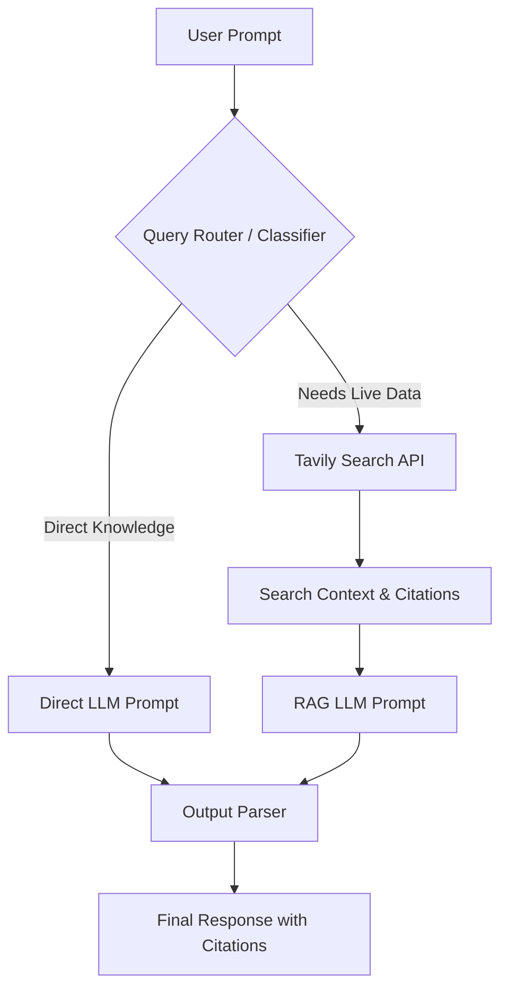

# Real-Time RAG Pipeline with Live Web Search 🔍🤖

An intelligent Retrieval-Augmented Generation (RAG) pipeline built using Python, LangChain, Tavily Search API, and the Cerebras Inference Engine. This project features dynamic query routing to decide whether a user's prompt can be answered using general knowledge or requires real-time web search for fresh, time-sensitive data.

---

## ✨ Features

- **⚡ Fast Inference**: Powered by the Cerebras LLM engine (`gpt-oss-120b`) for rapid responses.
- **🛣️ Intelligent Query Routing**: Classifies queries automatically to avoid redundant search API calls.
  - **Direct Path**: For general concepts, definitions, and static knowledge.
  - **RAG Path**: For breaking news, recent events, stock/crypto prices, or time-sensitive topics.
- **🌐 Live Web Search Integration**: Searches and compiles web context via Tavily Search API.
- **📚 Smart Citations**: Output automatically includes citation markers (e.g., `[Source 1]`) pointing to relevant URL references.
- **🔒 Environment Isolation**: Built from the ground up to keep API credentials secure using dotenv integration.

---

## 🏗️ Architecture Flow



---

## 🛠️ Setup Instructions

### 1. Prerequisites
- Python 3.9 or higher.
- API keys for:
  - **Cerebras Cloud** (Get a free key from the [Cerebras Console](https://cloud.cerebras.ai))
  - **Tavily Search** (Get a free key from the [Tavily Dashboard](https://tavily.com))

### 2. Clone and Install
First, clone this repository (or copy the files) and navigate to the directory:
```bash
cd rag-pipeline
```

Install the dependencies:
```bash
pip install -r requirements.txt
```

### 3. Configure API Keys (Securely)
This project uses `python-dotenv` to manage credentials. The `.env` file containing your private API keys is ignored by Git and will **never** be uploaded.

1. Copy the template file to create your local `.env`:
   ```bash
   cp .env.example .env
   ```
2. Open `.env` and replace the placeholder values with your actual API keys:
   ```env
   CEREBRAS_API_KEY=your_actual_cerebras_key_here
   TAVILY_API_KEY=your_actual_tavily_key_here
   ```

---

## 🚀 Running the Pipeline

Start the interactive session:
```bash
python rag_pipeline.py
```

### Example Usage:

```text
============================================================
Real-Time RAG Pipeline with Query Routing
Ask any question and get a cited answer from the live web!
Type 'quit' to exit.
============================================================

Your question: What is machine learning?
Route: direct_answer
Answering from general knowledge...

Answer:
Machine learning is a subset of artificial intelligence (AI) focused on building systems that learn from data...

Your question: Who won the latest Formula 1 race?
Route: web_search
Searching the web for: Who won the latest Formula 1 race?
Generating answer...

Answer:
Max Verstappen won the latest Formula 1 race [Source 1] ahead of Lando Norris [Source 2]...
```

### 🧪 Testing Modules in the Interactive Shell

You can also run Python in interactive mode (`-i`) to import and test components like the web search module individually:

```bash
python -i rag_pipeline.py
```

Then inside the interactive session, call functions directly to test retrieval output:
```python
>>> print(search_web("What is retrieval augmented generation"))
```

---

## 📸 Demo & Screenshots

Here are some screenshots demonstrating the RAG pipeline in action:

#### 1. Dynamic Query Routing & Web Search


*The system classifies incoming questions, routing them either directly or via web search (e.g., fetching real-time AI regulation developments).*

#### 2. Detailed RAG Output with Tables & Citations


*An example of in-depth web search integration returning structured markdown tables and source citation markers.*

#### 3. Direct Answers (General Knowledge)


*If the query classifier routes a question to direct knowledge, it executes instantly without calling Tavily, saving API resources.*

#### 4. Interactive Module Testing (Shell Mode)
Testing the core `search_web()` function interactively in the terminal:

````carousel

<!-- slide -->

<!-- slide -->

````

---

## 🔒 Security Best Practices for GitHub Uploads

To upload this project to GitHub without risking API key leaks:

1. **Verify `.gitignore` is present**:
   The `.gitignore` file includes `.env`, which tells Git to ignore your local API keys.
2. **Double check Git Status** (before committing):
   ```bash
   git status
   ```
   *Make sure `.env` is **not** listed under "Untracked files".*
3. **Commit and Push**:
   Initialize Git, commit your files, and push to your new GitHub repository:
   ```bash
   git init
   git add .
   git commit -m "Initial commit: secure RAG pipeline with search routing"
   git branch -M main
   git remote add origin https://github.com/YOUR_USERNAME/YOUR_REPOSITORY.git
   git push -u origin main
   ```
