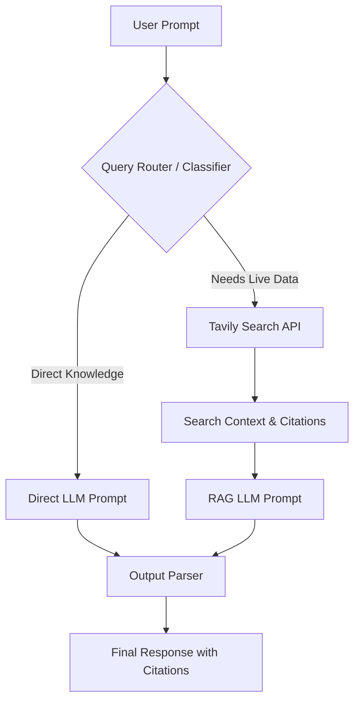
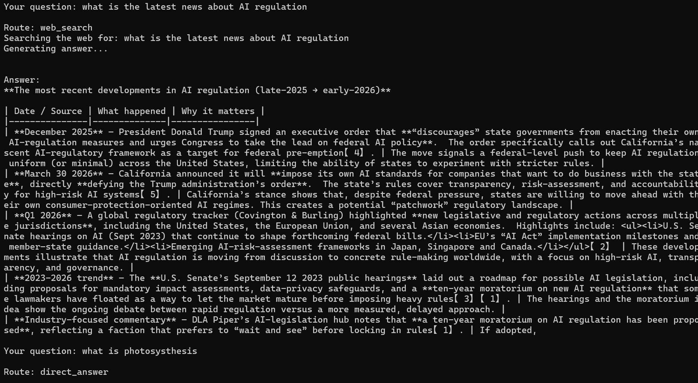
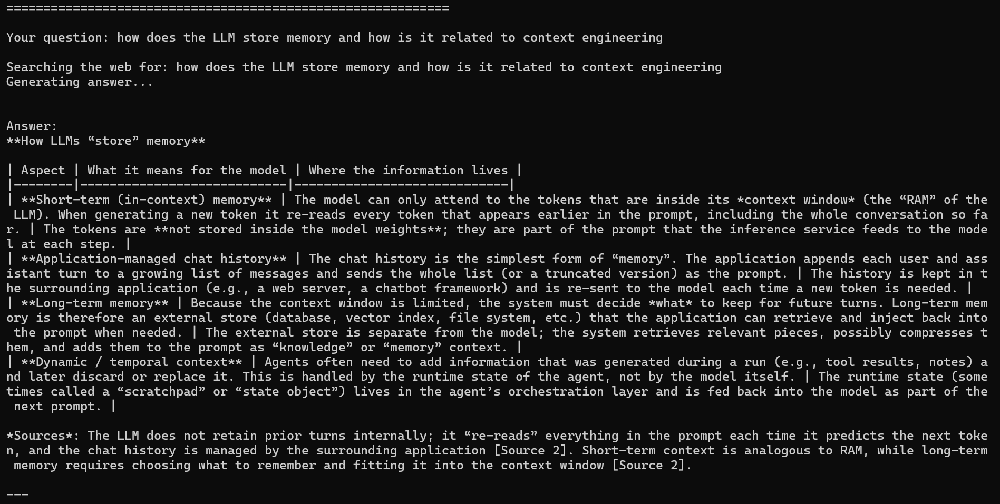
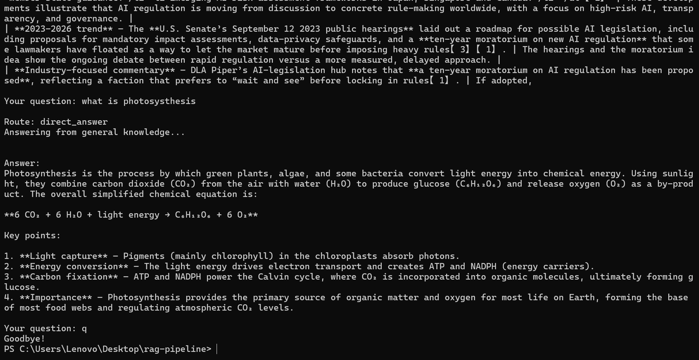
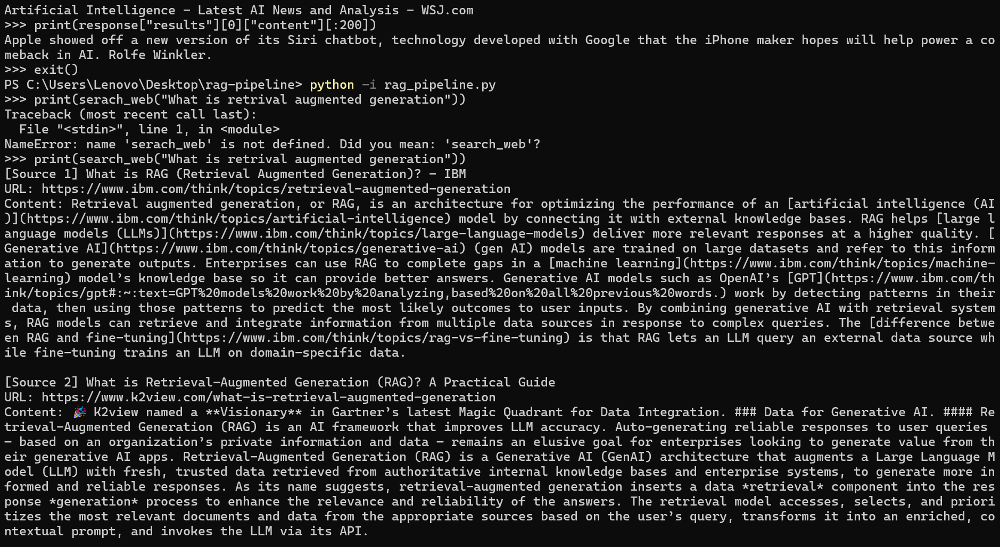
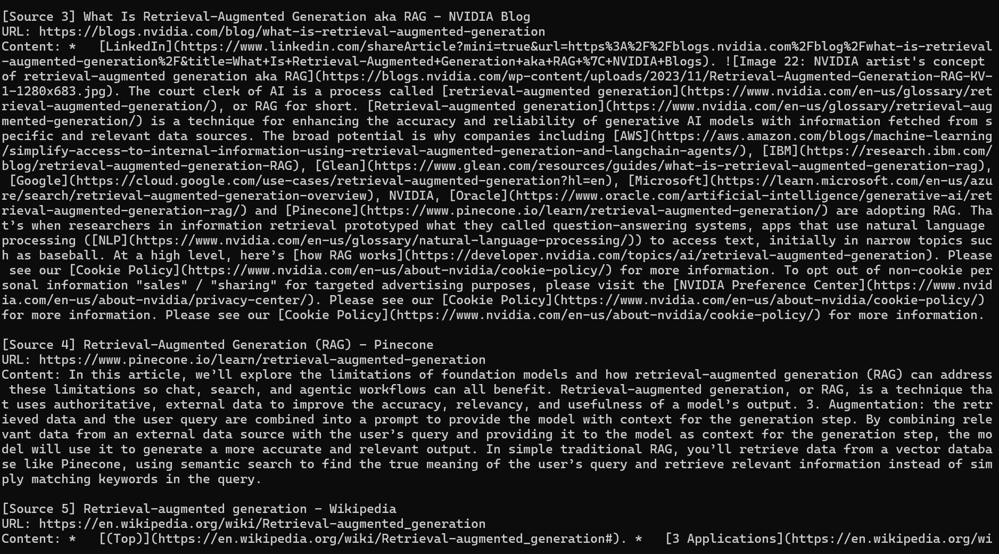
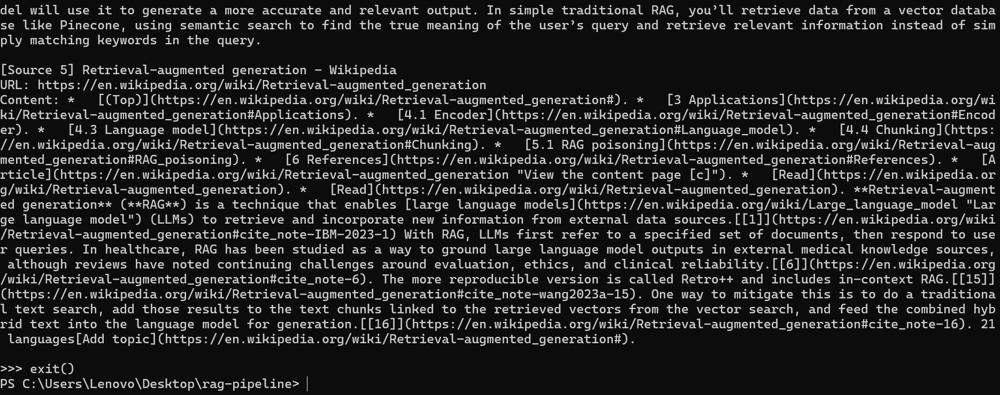

# Real-Time RAG Pipeline with Live Web Search

An intelligent Retrieval-Augmented Generation (RAG) pipeline built using Python, LangChain, Tavily Search API, and the Cerebras Inference Engine. This project features dynamic query routing to decide whether a user's prompt can be answered using general knowledge or requires real-time web search for fresh, time-sensitive data.

---

## Features

- **Fast Inference**: Powered by the Cerebras LLM engine (`gpt-oss-120b`) for rapid responses.
- **Intelligent Query Routing**: Classifies queries automatically to avoid redundant search API calls.
  - **Direct Path**: For general concepts, definitions, and static knowledge.
  - **RAG Path**: For breaking news, recent events, stock/crypto prices, or time-sensitive topics.
- **Live Web Search Integration**: Searches and compiles web context via Tavily Search API.
- **Smart Citations**: Output automatically includes citation markers (e.g., `[Source 1]`) pointing to relevant URL references.
- **Environment Isolation**: Uses python-dotenv to keep API credentials secure and separated from the codebase.

---

## Architecture Flow



---

## How It Works

This project implements an intelligent Retrieval-Augmented Generation (RAG) agent that selectively queries the live web based on the intent of your question. Under the hood, the pipeline follows these steps:

1. **Intelligent Query Classification**: 
   When you input a question, the agent sends it to [classify_question](file:///c:/Users/Lenovo/Desktop/rag-pipeline/rag_pipeline.py#L39). The Cerebras LLM evaluates the prompt to determine whether it is time-sensitive (such as live events, current prices, news) or general knowledge.
2. **Dynamic Routing**:
   * **`web_search` Route**: If the question requires fresh data, the pipeline triggers [search_web](file:///c:/Users/Lenovo/Desktop/rag-pipeline/rag_pipeline.py#L22) to query the internet using the Tavily Search API. It retrieves and formats the top 5 relevant web sources (including URLs and content snippets).
   * **`direct_answer` Route**: If the question is about general concepts or static facts, the pipeline bypasses the web search entirely to save search API credits and reduce latency.
3. **Response Generation**:
   * For the web search route, the [rag_chain](file:///c:/Users/Lenovo/Desktop/rag-pipeline/rag_pipeline.py#L87) combines the user query with the retrieved context and prompts the LLM to generate an answer with inline source citations (`[Source N]`).
   * For the direct route, the [direct_chain](file:///c:/Users/Lenovo/Desktop/rag-pipeline/rag_pipeline.py#L88) prompts the LLM to respond directly from its internal pre-trained weights.
4. **Output Parsing**:
   The response is structured and streamed to the command-line interface via LangChain's `StrOutputParser`.

---

## Setup Instructions

### 1. Prerequisites
- Python 3.9 or higher.
- API keys for:
  - **Cerebras Cloud** (available via the Cerebras Console)
  - **Tavily Search** (available via the Tavily Dashboard)

### 2. Installation
Clone or download the project files, navigate to the directory, and install the dependencies:
```bash
cd rag-pipeline
pip install -r requirements.txt
```

### 3. Configuration
This project uses environment variables to manage credentials. 

1. Copy the template file to create your local `.env`:
   ```bash
   cp .env.example .env
   ```
2. Open `.env` and configure your API credentials:
   ```env
   CEREBRAS_API_KEY=your_actual_cerebras_key_here
   TAVILY_API_KEY=your_actual_tavily_key_here
   ```

---

## Running the Pipeline

Start the interactive session:
```bash
python rag_pipeline.py
```

### Example Usage

```text
============================================================
Real-Time RAG Pipeline with Query Routing
Ask any question and get a cited answer from the live web!
Type 'quit' to exit.
============================================================

Your question: What is machine learning?
Route: direct_answer
Answering from general knowledge...

Answer:
Machine learning is a subset of artificial intelligence (AI) focused on building systems that learn from data...

Your question: Who won the latest Formula 1 race?
Route: web_search
Searching the web for: Who won the latest Formula 1 race?
Generating answer...

Answer:
Max Verstappen won the latest Formula 1 race [Source 1] ahead of Lando Norris [Source 2]...
```

### Testing Modules in the Interactive Shell

To import and test components (such as the web search module) individually, run Python in interactive mode:

```bash
python -i rag_pipeline.py
```

Then invoke functions directly inside the interactive session:
```python
>>> print(search_web("What is retrieval augmented generation"))
```

---

## Demo and Screenshots

Below are screenshots demonstrating the pipeline execution:

#### 1. Dynamic Query Routing and Web Search


*The system classifies incoming questions, routing them either directly or via web search (e.g., retrieving live AI regulation developments).*

#### 2. Detailed RAG Output with Tables and Citations


*An example of deep web search integration returning structured markdown tables and source citation markers.*

#### 3. Direct Answers (General Knowledge)


*When the classifier routes queries to local knowledge, answers are generated immediately without invoking the search API.*

#### 4. Interactive Module Testing (Shell Mode)
Testing the core `search_web()` function interactively in the terminal:

````carousel

<!-- slide -->

<!-- slide -->

````

---

## How It Works

This project implements a Retrieval-Augmented Generation (RAG) pipeline designed for low-latency, fact-accurate, and context-rich responses. The core workflow combines **intelligent query routing**, **live web search retrieval**, and **high-speed LLM generation**.

Below is a step-by-step breakdown of how the pipeline processes a user query:

### 1. Initialization & Configuration
When the script starts, it loads configuration and credentials from the local `.env` file via `python-dotenv`. It then initializes two core clients:
* **Cerebras LLM Engine (`ChatCerebras`)**: Interfaces with Cerebras Cloud's high-speed inference engine using the `gpt-oss-120b` model.
* **Tavily Search Client (`TavilyClient`)**: Connects to the search engine optimized specifically for AI agent retrieval to gather real-time web results.

### 2. Intelligent Query Routing (Classification)
To reduce latency, control API usage, and optimize performance, the system does not search the web for every question. Instead, it uses a classifier LLM step:
* The user's question is passed to a classification prompt.
* The model categorizes the query into one of two routes:
  * `web_search`: For current events, live statistics, recent news, or any time-sensitive query.
  * `direct_answer`: For static knowledge, general concepts, definitions, or well-established facts.

### 3. Processing Paths

```mermaid
flowchart TD
    Start[User Inputs Question] --> Route{Query Router}
    Route -->|web_search| Search[Tavily Search API]
    Route -->|direct_answer| Direct[LLM Direct Path]
    
    Search --> Format[Context Formatting & [Source N] Mapping]
    Format --> Prompt[RAG Prompt Assembly]
    Prompt --> GenRAG[Cerebras LLM Generation]
    
    Direct --> GenDirect[Cerebras LLM Generation]
    
    GenRAG --> Output[Citations and Final Answer]
    GenDirect --> Output
```

#### Route A: Direct Answer (Static/General Knowledge)
1. If the router returns `direct_answer`, the search API call is skipped entirely.
2. The question is formatted using the `direct_prompt` template.
3. The LLM generates a response instantly based on its built-in knowledge base.

#### Route B: RAG with Live Web Search (Dynamic/Time-sensitive Knowledge)
1. **Retrieval**: If routed to `web_search`, the system queries the Tavily Search API, fetching the top 5 web results.
2. **Context Formatting**: The pipeline parses each result into structured context containing:
   * **Source Citation ID** (e.g., `[Source 1]`)
   * **Webpage Title**
   * **Webpage URL**
   * **Content Snippet**
3. **Prompt Augmentation**: The system inserts the formatted search results and the user's question into the `rag_prompt` template.
4. **Context-Grounded Generation**: The LLM synthesizes an answer using *only* the retrieved context and applies inline citations (e.g., `[Source N]`) corresponding to the web sources used.

### 4. Output Generation & Parsing
Both execution paths chain their prompt templates and LLM outputs to a LangChain `StrOutputParser` using the LangChain Expression Language (LCEL) pipe operator (`|`). This returns a clean string response to the terminal, complete with URLs and clickable sources when the web search route is activated.

